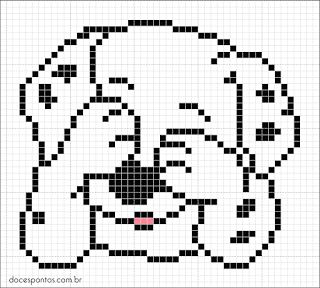

Criando **minha**, _página_, ~~principal~~.

# Quem sou eu?  
Sou um estudante de jogos que gosta muita de biscoito.

# Produções

## Games

[jogo 1 oficina : Supermeatboy](https://lucas-manolo.github.io/Invoke/)

## Artes  
  

## Apresentações
* Aula de música  
* Aula de tatro  
* Aula chata  

## Jogos  

Jogos feitos na disciplina Oficina de Jogos Digitais. A meta é fazer um jogo em cada bimestre. Devido ao curto espaço de tempo, os jogos são curtos e podem apresentar alguns bugs.

**Invoke**
 
**Bom Apetite!**
 
**Óculos que tudo vê**
  

***

##Artes

Algumas artes que produzi ao longo do curso de jogos digitais. 

  
  
  
  
 

* * *

** negrito  
_ _ italico  
~~ ~~ traçado  
   dois espaços para pular linha  
3* fazem barra  
#deixa o titulo maior  
Mais de uma # cria subcapítulos
*(asteriscios) fazem lista não numerada  
2(numeros0 fazem lista numerada
