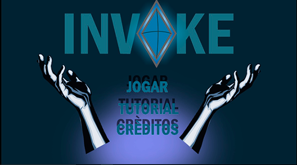
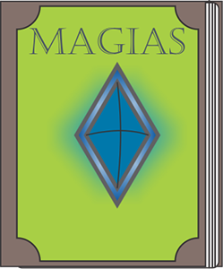
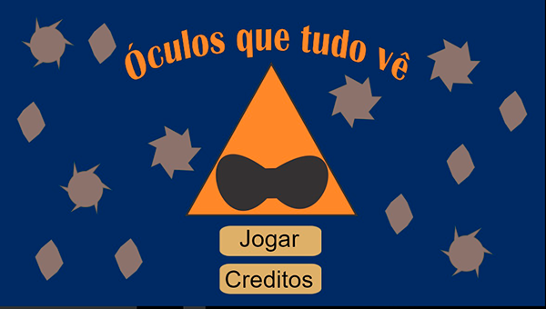
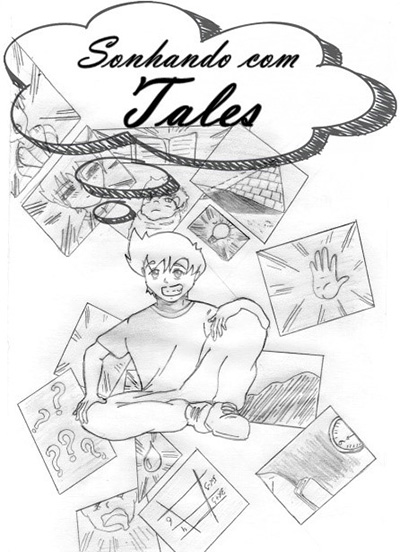

# Quem sou eu?  
Sou estudante do curso de Programação de Jogos Digitais do IFRN, muito embora eu ache que o nome mais apropriado seja Desenvolvimento de Jogos Digitais. Ainda que tenha conhecimentos para atuar em áreas como programação, design gráfico ~~e animação~~, a minha função preferida é a de **GameDesigner**. Além de gostar muito de joginhos, possuo muita admiração por cultura e arte e procuro estar envolvido em questões políticas e sociais também.

    

***

## Jogos  

Jogos feitos na disciplina Oficina de Jogos Digitais. A meta é fazer um jogo em cada bimestre. Devido ao curto espaço de tempo, os jogos são curtos e podem apresentar alguns bugs.
Muito embora eu tenha criado certas artes para os jogos, minha participação principal fica nas áreas de conceito, Gamedesign e Leveldesign.

    

***

## Artes

Algumas artes que produzi ao longo do curso de jogos digitais. 

### Artes para jogo Bom apetite!  
Neste jogo fiz algumas artes de personagem e objeto.  
 
### Artes para jogo Invoke  
Neste jogo eu fiz a arte dos elementos do HUD, além de fazer o menu incial.  
  
    
                 
### Artes para jogo Óculos que tudo vê 
Já aqui, foquei minhas habilidades no Game e Leveldesign. Mesmo assim, fiz as artes das telas de menu inicial e de game over.  
  
    
 
***
## Outros projetos
Ainda que o IFRN nos tome bastante tempo, milagrosamente ainda podemos realizar certas atividades. Aqui deixo alguns tranalho que, direta e indiretamente, contribuem para as minhas aspirações na área de Jogos Digitais.

### Mangás 
Os mangás foram feitos em parceria com o artista Mychellangello Ruttyelli, responsável por toda a parte visual. A mim coube o roteiro das obras.  

### Projeto social (em construção)  
O projeto ainda está em fase embrionária, mas já podemos dar algumas informações.

 

* * *

## Contatos:
**Email**:lucasemmanuell27@gmail.com

