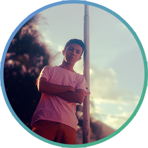
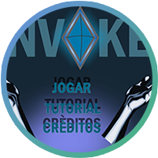

Criando **minha**, _página_, ~~principal~~.

# Quem sou eu?  
Sou estudante do curso de Programação de Jogos Digitais do IFRN, muito embora eu ache que o nome mais apropriado seja Desenvolvimento de Jogos Digitais. Ainda que tenha conhecimentos para atuar em áreas como programação, design gráfico ~~e animação~~, a minha função preferida é a de **GameDesigner**. Além de gostar muito de joginhos, possuo muita admiração por cultura e arte e procuro estar envolvido em questões políticas e sociais também.

 

***

## Jogos  

Jogos feitos na disciplina Oficina de Jogos Digitais. A meta é fazer um jogo em cada bimestre. Devido ao curto espaço de tempo, os jogos são curtos e podem apresentar alguns bugs.

    

***

## Artes

Algumas artes que produzi ao longo do curso de jogos digitais. 

### Artes para jogo Bom apetite!  
Neste jogo fiz algumas artes de personagem e objeto.

 

  
  
  
  
 
***

* * *

** negrito  
_ _ italico  
~~ ~~ traçado  
   dois espaços para pular linha  
3* fazem barra  
#deixa o titulo maior  
Mais de uma # cria subcapítulos
*(asteriscios) fazem lista não numerada  
2(numeros0 fazem lista numerada
